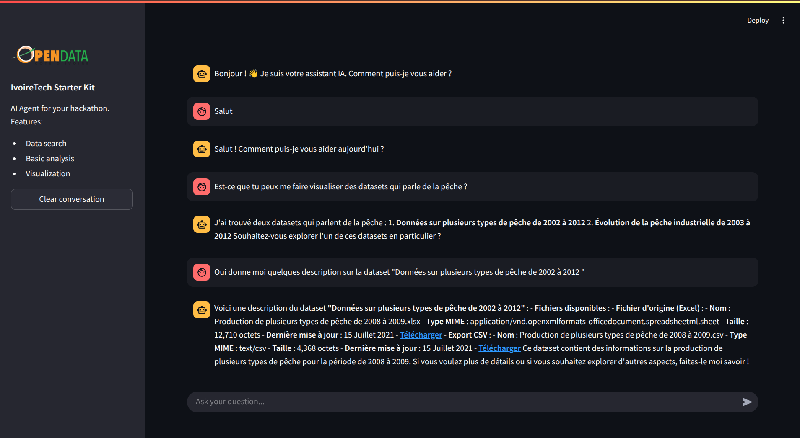

# IvoireTech Starter Kit 🚀

Un agent IA intelligent conçu pour les hackathons, permettant la recherche de données, l'analyse et la visualisation automatique.

## 🌟 Fonctionnalités

- **Agent IA conversationnel** avec interface de chat intuitive
- **Recherche de données** via serveur MCP intégré
- **Analyse automatique** des données
- **Visualisation interactive** avec génération automatique de graphiques
- **Interface moderne** avec Streamlit
- **Arrêt de génération en temps réel**

## 📋 Prérequis

- Python 3.8 ou version supérieure
- Accès Internet pour les requêtes du serveur MCP
- Clé API OpenAI (si vous utilisez le modèle OpenAI)

## 🛠️ Installation

### 1. Cloner le projet

```bash
git clone https://github.com/data354/IvoireTech-Starter-Kit.git
cd IvoireTech-Starter-Kit
```

### 2. Créer un environnement virtuel

```bash
python -m venv .venv
# Activer l'environnement
# Sur Windows
.venv\Scripts\activate
# Sur macOS/Linux
source .venv/bin/activate
```

### 3. Installer les dépendances

```bash
pip install -r requirements.txt
```

### 4. Configuration des variables d'environnement

Créer un fichier `.env` à la racine du projet :

```env
OPENAI_API_KEY=votre_cle_api_openai_ici
```

## 🚀 Lancement de l'application

### Méthode 1 : Lancement standard

```bash
streamlit run client.py
```

### Méthode 2 : Avec configuration personnalisée

```bash
streamlit run client.py --server.port 8501 --server.address 0.0.0.0
```

L'application sera accessible à l'adresse : `http://localhost:8501`

## 💡 Utilisation

### Interface principale

1. **Zone de chat** : Posez des questions à l'agent IA
2. **Barre latérale** : Informations sur le projet et bouton de réinitialisation
3. **Visualisations automatiques** : Les graphiques s'affichent automatiquement lorsque des données tabulaires sont détectées

### Exemples de requêtes

```
"Peux-tu me donner des données sur la population ivoirienne ?"
"Analyse les tendances économiques de la Côte d'Ivoire"
"Recherche des informations sur le secteur agricole"
```

### Fonctionnalités avancées

- **Arrêt de génération** : Cliquez sur "⏹️ Arrêter la génération" pour interrompre une réponse
- **Graphiques automatiques** : Les tableaux dans les réponses sont automatiquement convertis en graphiques
- **Historique persistant** : Vos conversations sont sauvegardées pendant la session

## 🔧 Configuration

### Serveur MCP

Le client se connecte au serveur MCP hébergé :

- URL : `https://mcp-server-626474317752.europe-west1.run.app/mcp/`
- Transport : `streamable_http`

### Modèle IA

- Modèle utilisé : `openai:gpt-4o`
- Framework : LangGraph avec agent ReAct

## 📊 Visualisations

L'application génère automatiquement des graphiques à partir de données tabulaires :

- **Détection automatique** des tableaux dans les réponses
- **Conversion en DataFrame** Pandas
- **Graphiques interactifs** avec Plotly
- **Types supportés** : Graphiques en barres, courbes, etc.

## 🐛 Résolution des problèmes

### Problèmes courants

1. **Erreur de connexion MCP**

   ```
   Vérifiez votre connexion Internet
   Le serveur MCP doit être accessible
   ```

2. **Erreur API OpenAI**

   ```
   Vérifiez votre clé API dans le fichier .env
   Assurez-vous d'avoir suffisamment de crédits
   ```

3. **Problème de dépendances**
   ```bash
   pip install --upgrade -r requirements.txt
   ```

### Logs et débogage

Pour plus de détails sur les erreurs :

```bash
streamlit run client.py --logger.level debug
```

## 📦 Structure du projet

```
IvoireTech-Starter-Kit/
├── client.py                 # Application principale
├── requirements.txt          # Dépendances Python
├── .env                     # Variables d'environnement
├── README.md               # Documentation
└── .venv/                  # Environnement virtuel
```

## 🤝 Contribution

Les contributions sont les bienvenues ! N'hésitez pas à :

- Signaler des bugs
- Proposer de nouvelles fonctionnalités
- Améliorer la documentation
- Soumettre des pull requests

## 🆘 Support

Pour toute question ou problème :

- Ouvrez une issue sur GitHub
- Contactez l'équipe de développement
- Consultez la documentation
## Images du client
- 

## Ressources additionnelles
- Lien d'un client notebook : `https://colab.research.google.com/drive/1jLcCBro-Hm0_sUILKhvACiQYfMQ2t6aO?usp=sharing`
- Google Gen AI SDK: `https://github.com/googleapis/python-genai`
- Documentation Google Gen AI SDK : `https://googleapis.github.io/python-genai/`
- Utilisation de l'API Gemini: `https://ai.google.dev/gemini-api/docs/api-key`
- MCP Client: `https://github.com/googleapis/python-genai`
- MCP Client NPM: `https://www.npmjs.com/package/mcp-client`
- MCP Client PHP: `https://github.com/modelcontextprotocol`
- MCP Client Python: `https://github.com/logiscape/mcp-sdk-php`
- MCP Client Java: `https://inspector.dev/ai-agents-in-php-with-mcp-model-context-protocol/`
- MCP Client Node.js: `https://blog.marcnuri.com/connecting-to-mcp-server-with-langchainjs`

---

**IvoireTech Starter Kit** - 🇨🇮
